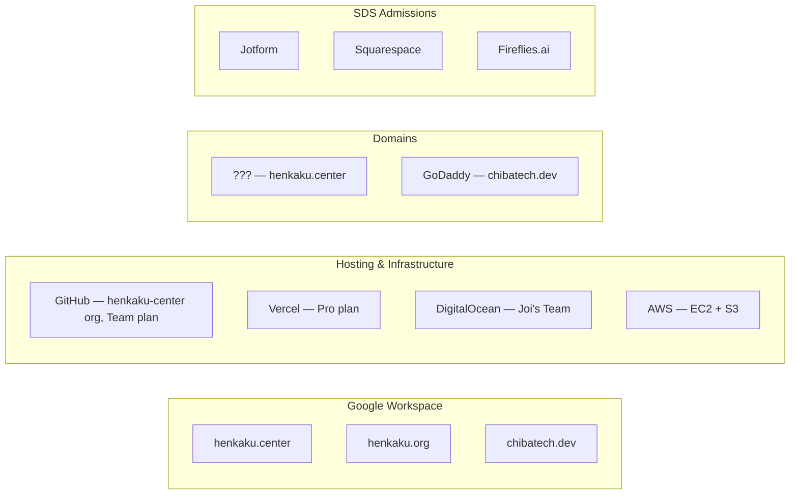
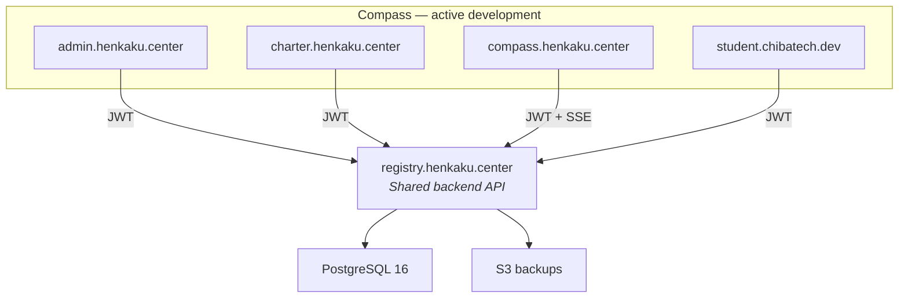
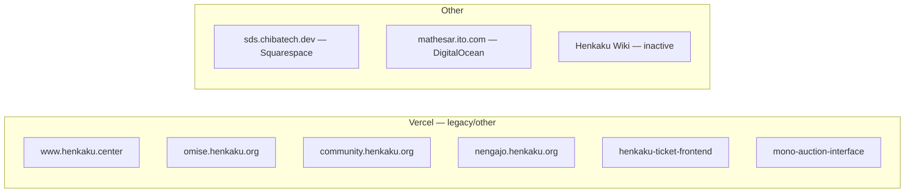
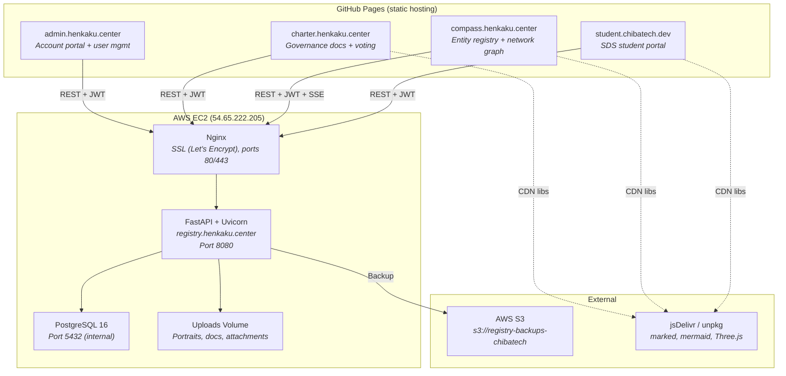
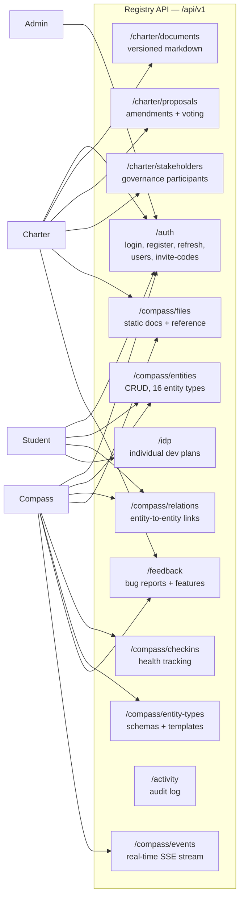
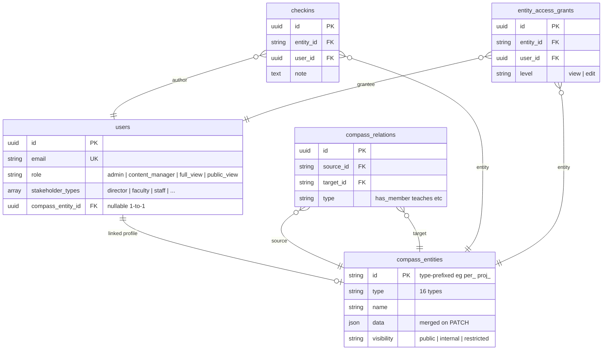
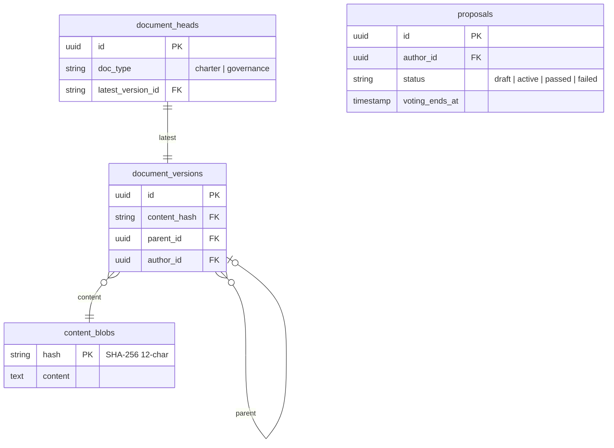
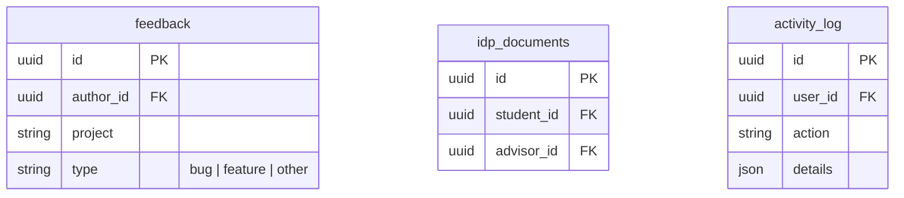
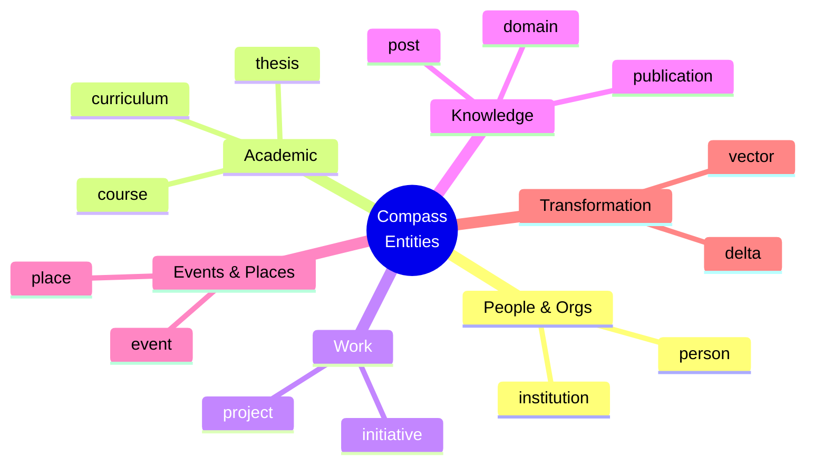
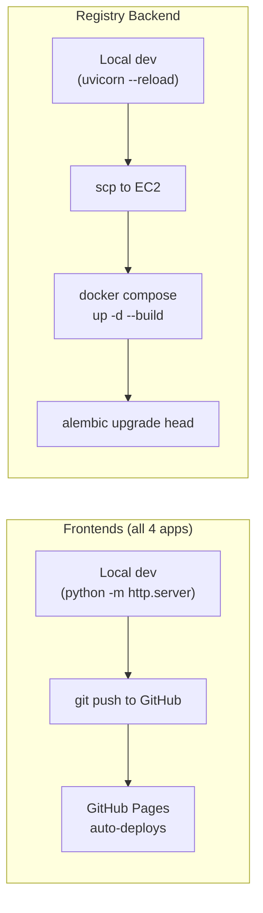

# Henkaku & SDS Infrastructure

> **WORK IN PROGRESS** — This document may contain inaccuracies or incomplete information. Do not treat it as authoritative until verified. If you spot errors, please flag them.

> Full inventory of organizational and technical infrastructure, April 2026.

## Overview

### Organization Accounts

### Services Map

---

## 1. Organization Accounts & Billing

### Google Workspace

| Workspace | Plan | Monthly cost | Billing | Admin |
|-----------|------|-------------|---------|-------|
| **henkaku.center** | Business Starter | 5,225 JPY | Visa ****0187 | Boris |
| **henkaku.org** | Business Starter | ~2,000 JPY | Visa ****0187 | Boris |
| **chibatech.dev** | Business Starter | 7,500 JPY | Visa ****0120 | Ira |

**henkaku.center users** (12):

| Name | Email | Role |
|------|-------|------|
| Boris Anthony | boris@henkaku.center | Super Admin |
| Daum Kim | daum@henkaku.center | Super Admin |
| Grisha Szep | grisha@henkaku.center | Super Admin |
| Ira Winder | ira@henkaku.center | Super Admin |
| Joi Ito | joi@henkaku.center | Super Admin |
| Miho Shinada | miho@henkaku.center | User Mgmt / Groups / Services Admin |
| Jess Sousa | jess@henkaku.center | User |
| Events | events@henkaku.center | Service account |
| Office | office@henkaku.center | Service account |
| VPN | vpn@henkaku.center | Service account |
| Wizard of Oz | wizard-of-oz@henkaku.center | Service account |
| YouTube | youtube@henkaku.center | Service account |

**henkaku.center groups**: admin@, billing@, compass@, events-admin@, help@, info@, noreply@, web-admin@, gairon@ (web3/AI概論), daniel@, events-deprecated@

**henkaku.org users** (4): admins@ (Super Admin), boris@ (Super Admin), crt@ (CRT), office@. **Group**: web-services@

### GitHub (`henkaku-center`)

| Plan | Monthly cost | Billing |
|------|-------------|---------|
| Team | ~$60 USD | Visa ****0187 |

| Login | Name | Role |
|-------|------|------|
| BorisAnthony | Boris Anthony | Owner |
| irawinder | Ira Winder | Owner |
| Joi | Joi Ito | Owner |
| GalRaz | | Owner |
| geeknees | Masumi Kawasaki | Owner |
| TatsuyaIshibe | Tatsuya Ishibe | Owner |
| batessamantha | | Owner |
| gszep | Grisha Szep | Member |
| AJamesPhillips | James Phillips | Member |
| cameronfreer | Cameron Freer | Member |
| josephausterweil | | Member |

### Vercel

| Plan | Monthly cost | Billing |
|------|-------------|---------|
| Pro | ~$80 USD | Visa ****0187 |

**Users**: borisanthony (Owner), geeknees (Owner), joiito (Owner), Ira Winder (Member)

**Projects**:

| Project | URL | Repo |
|---------|-----|------|
| cit-henkaku-org | www.henkaku.center | henkaku-center/henkaku-center-website |
| henkaku-omise | omise.henkaku.org | henkaku-center/omise-interface |
| henkaku-discord-landing | community.henkaku.org | henkaku-center/henkaku-discord-landing |
| henkaku-nengajo | nengajo.henkaku.org | henkaku-center/henkaku-nengajo-frontend |
| henkaku-ticket-frontend | henkaku-ticket-frontend.vercel.app | henkaku-center/henkaku-ticket-frontend |
| mono-auction-interface | mono-auction-interface.vercel.app | henkaku-center/mono-auction-interface |

### DigitalOcean

| Plan | Monthly cost | Billing |
|------|-------------|---------|
| Joi's Team | ~$36 USD | Visa ****0187 |

**Users**: BorisAnthony (Owner), kriti@centerofci.org (Owner), joi@ito.com (Member), mika-tanaka (Biller)

**Projects**: Mathesar (mathesar.ito.com), Henkaku Center Wiki (inactive)

### AWS

| Service | Resource | Purpose |
|---------|----------|---------|
| EC2 | `54.65.222.205` (ap-northeast-1) | Registry backend |
| S3 | `s3://registry-backups-chibatech` | Database backups |

### SDS Admissions Tools

| Service | Purpose |
|---------|---------|
| Jotform | Application forms |
| Squarespace | sds.chibatech.dev public website |
| Fireflies.ai | Meeting transcription |

---

## 2. Compass Architecture

The active development work — four frontend apps sharing one backend API.

### Frontend Apps

| App | Domain | Repo | Pages root | Key features |
|-----|--------|------|-----------|--------------|
| Admin | admin.henkaku.center | henkaku-center/admin | `/` | Account settings, user list, invite codes |
| Charter | charter.henkaku.center | henkaku-center/charter | `/` | Versioned governance docs, amendment proposals, weighted voting |
| Compass | compass.henkaku.center | henkaku-center/compass | `/` | 16 entity types, relations, 3D force-directed graph, check-ins |
| Student | student.chibatech.dev | henkaku-center/student | `docs/` | Orientation, courses, calendar, milestones, IDP, auth-gated |

All frontends: **vanilla HTML/CSS/JS** — no build process, no frameworks. Deployed by `git push` to GitHub Pages.

### CDN Dependencies

| Library | Used by | Purpose |
|---------|---------|---------|
| marked.js | Charter, Compass, Student | Markdown rendering |
| mermaid.js | Compass, Student | Gantt charts, diagrams |
| Three.js + 3d-force-graph | Compass | 3D network visualization |
| jszip | Charter | PDF/ZIP export |
| diff.js | Charter | Change tracking visualization |

### Registry Backend

| Component | Technology | Details |
|-----------|-----------|---------|
| Framework | FastAPI + Uvicorn | Python 3.12, fully async |
| Database | PostgreSQL 16 | 19 Alembic migrations |
| ORM | SQLAlchemy 2.0 (async) | asyncpg driver |
| Auth | JWT (python-jose) | 30min access + 7d refresh tokens |
| Real-time | SSE (sse-starlette) | Entity/relation change broadcasts |
| Rate limiting | slowapi | By X-Real-IP |
| Containers | Docker Compose | 3 services: api, db, nginx |
| SSL | Nginx + Let's Encrypt | Auto-renewed certs |
| Backups | S3 | `s3://registry-backups-chibatech` |

### API Surface

### Data Model

#### Identity & Compass

#### Charter & Governance

#### Supporting Tables

### Entity Types

---

## 3. Deployment

- **No CI/CD** for any repo — all manual
- **No staging environment** — single production server
- **No build process** — frontends served as-is

---

## 4. Domain Inventory

| Domain | Registrar/Host | Points to | Purpose |
|--------|---------------|-----------|---------|
| henkaku.center | (Boris) | Google Workspace + subdomains | Primary org domain |
| admin.henkaku.center | GitHub Pages CNAME | henkaku-center/admin | Account portal |
| charter.henkaku.center | GitHub Pages CNAME | henkaku-center/charter | Governance |
| compass.henkaku.center | GitHub Pages CNAME | henkaku-center/compass | Entity registry |
| registry.henkaku.center | DNS → EC2 | 54.65.222.205 | Backend API |
| www.henkaku.center | Vercel | henkaku-center-website | Main website |
| henkaku.org | (Boris) | Google Workspace | Secondary org domain |
| omise.henkaku.org | Vercel | omise-interface | Omise |
| community.henkaku.org | Vercel | discord-landing | Discord |
| nengajo.henkaku.org | Vercel | nengajo-frontend | Nengajo |
| chibatech.dev | GoDaddy (Ira) | Google Workspace + subdomains | SDS domain |
| sds.chibatech.dev | Squarespace | Squarespace | SDS public website |
| student.chibatech.dev | GitHub Pages CNAME | henkaku-center/student | Student portal |
| mathesar.ito.com | DigitalOcean | Mathesar | Data tool |

---

## 5. Key Facts

- **Single auth system** — Registry JWT serves all four Compass Initiative apps
- **Unified identity** — User (login) ↔ CompassEntity (profile), linked via `compass_entity_id`
- **Role hierarchy** — `public_view` < `full_view` < `content_manager` < `admin`
- **Entity visibility** — `public` / `internal` / `restricted` with cascading relation filtering
- **Background jobs** — proposal auto-resolution every 30s (in-process, no queue)
- **Real-time** — SSE broadcasts entity/relation changes to Compass frontend
- **Vercel projects** are mostly legacy web3-era projects, not part of active Compass development
- **DigitalOcean** is underutilized — only Mathesar active, wiki inactive
